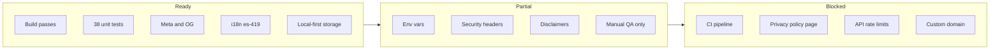

# Road to Production Tracker

> **This is not the [roadmap](ROADMAP.md).** The roadmap plans future product phases. This tracker audits **what exists today** (v0.1.0) and what is still required to ship it publicly at a production URL.
>
> **Last audited:** 2026-07-02  
> **App version:** `0.1.0`  
> **Stack:** Next.js 16 · React 19 · IndexedDB (Dexie) · optional OpenAI lookup

---

## Readiness snapshot

| Metric | Value |
|--------|-------|
| **Overall readiness** | **52%** (22 / 42 checklist items) |
| **Shippable as private beta?** | Yes — with disclaimers and manual QA |
| **Shippable as public production?** | Not yet — legal, CI, API hardening, and domain remain |




---

## How to use this doc

1. Work top to bottom within each section — **P0** items block a public launch.
2. Check boxes as items complete; update the **Last audited** date.
3. Do **not** move roadmap items here unless they are required to ship *today's* app.
4. After each release candidate, re-run: `npm test && npm run build && npm run lint`.

**Status legend:** ✅ Done · 🟡 Partial · ❌ Missing · ⏸ Deferred (acceptable for v0.1)

---

## 1. Build & runtime

| ID | Item | Status | Current state | Action |
|----|------|--------|---------------|--------|
| P-001 | Production build | ✅ | `npm run build` passes (Next.js 16, Turbopack) | — |
| P-002 | TypeScript strict | ✅ | `tsc` runs in build | — |
| P-003 | ESLint | ✅ | `npm run lint` passes | — |
| P-004 | Unit tests | ✅ | 38 Vitest tests in `lib/` | Add E2E before calling it "fully tested" |
| P-005 | Node version pinned | ❌ | No `.nvmrc` / `engines` in `package.json` | Add `engines: { node: ">=20" }` |
| P-006 | Package manager | 🟡 | Both `package-lock.json` and `pnpm-lock.yaml` | Pick one; document in README |
| P-007 | Start script | ✅ | `npm start` serves production build | — |

---

## 2. Meta, SEO & social

| ID | Item | Status | Current state | Action |
|----|------|--------|---------------|--------|
| P-010 | Site title & template | ✅ | `lib/constants/metadata.ts` — `%s · Skincare for You` | — |
| P-011 | Per-page metadata | ✅ | Home, Products, Routines, Body (`PAGE_METADATA`) | — |
| P-012 | `metadataBase` / canonical URL | 🟡 | `NEXT_PUBLIC_SITE_URL` in `lib/constants/site.ts`; defaults to localhost | Set in Vercel env for prod |
| P-013 | Open Graph image | ✅ | `public/og.png` (1200×630) + `openGraph` in metadata | Regenerate if brand changes |
| P-014 | Twitter card | ✅ | `summary_large_image` in metadata | — |
| P-015 | Favicon / app icon | ✅ | `app/icon.svg` + `public/icon.svg` (rose heart) | Consider `apple-touch-icon` PNG |
| P-016 | `robots.txt` | ✅ | `app/robots.ts` — allows `/`, blocks `/api/` | — |
| P-017 | `sitemap.xml` | ✅ | `app/sitemap.ts` — `/`, `/products`, `/routines`, `/cycle` | — |
| P-018 | `theme-color` | ✅ | `#E04362` in root viewport | — |
| P-019 | Web app manifest | ❌ | No `manifest.json` / PWA | Phase 2 if installable app needed |
| P-020 | `hreflang` alternates | ⏸ | Single app with in-app locale toggle | Optional `alternates.languages` later |

**Assets inventory**

| Asset | Path | Purpose |
|-------|------|---------|
| OG / social preview | `public/og.png` | Link previews (iMessage, Slack, X, etc.) |
| Favicon | `public/icon.svg` | Browser tab, bookmarks |
| Readiness diagram | `docs/production/readiness-overview.svg` | This tracker doc |

---

## 3. Brand & copy

| ID | Item | Status | Current state | Action |
|----|------|--------|---------------|--------|
| P-030 | Product name | ✅ | **Skincare for You** — same in EN and ES | — |
| P-031 | Logo in app | ✅ | `AppLogo` — wordmark + heartbeat heart | — |
| P-032 | Tagline in meta | ✅ | "Personal skin care routines…" in `SITE_DESCRIPTION` | Localize meta descriptions later |
| P-033 | In-app medical disclaimer | 🟡 | Implied in conflict UI; not a global footer | Add short "not medical advice" footer or About |
| P-034 | PDF branding | 🟡 | Uses `SITE_NAME` in Helvetica plain text | Match app fonts/colors in v0.3 |

---

## 4. Environment & deployment

| ID | Item | Status | Current state | Action |
|----|------|--------|---------------|--------|
| P-040 | `.env.example` | ✅ | Documents `OPENAI_API_KEY`, `NEXT_PUBLIC_AMAZON_ASSOCIATE_TAG`, `NEXT_PUBLIC_SITE_URL` | — |
| P-041 | Env validation | 🟡 | `lib/env.ts` validates `OPENAI_API_KEY` only | Validate `NEXT_PUBLIC_SITE_URL` in prod |
| P-042 | Hosting target | 🟡 | Standard Next.js — README mentions Vercel | Link Vercel project; no `vercel.json` yet |
| P-043 | Custom domain + SSL | ❌ | Not configured | Buy/configure domain; set `NEXT_PUBLIC_SITE_URL` |
| P-044 | `OPENAI_API_KEY` (prod) | 🟡 | Optional — mock fallback without key | Set for real lookups; monitor cost |
| P-045 | `NEXT_PUBLIC_AMAZON_ASSOCIATE_TAG` | ⏸ | Optional affiliate links on seed products | Set if monetizing Amazon links |
| P-046 | Preview vs production envs | ❌ | No documented env matrix | Document Vercel Preview/Production vars |

**Production env checklist (Vercel)**

```env
NEXT_PUBLIC_SITE_URL=https://your-domain.com
OPENAI_API_KEY=sk-...          # required for real product lookup
NEXT_PUBLIC_AMAZON_ASSOCIATE_TAG=yourtag-20   # optional
```

---

## 5. Security

| ID | Item | Status | Current state | Action |
|----|------|--------|---------------|--------|
| P-050 | API key server-only | ✅ | `OPENAI_API_KEY` never exposed to client | — |
| P-051 | Lookup input validation | ✅ | Zod schema on API route + server action | — |
| P-052 | API rate limiting | ❌ | `POST /api/products/lookup` unauthenticated, unlimited | Add rate limit (Vercel KV / Upstash) |
| P-053 | Security headers | ❌ | No CSP, HSTS, or `headers()` in `next.config` | Add baseline security headers |
| P-054 | Dependency audit | ❌ | No `npm audit` in CI | Add to CI; review high/critical |
| P-055 | Secrets in repo | ✅ | No `.env` committed; `.env.example` only | — |

---

## 6. Privacy & legal

| ID | Item | Status | Current state | Action |
|----|------|--------|---------------|--------|
| P-060 | Data stays local (body settings) | ✅ | IndexedDB only; privacy notice on Body page | — |
| P-061 | OpenAI data disclosure | 🟡 | README mentions lookup goes to server | Add to public privacy policy |
| P-062 | Privacy policy page | ❌ | No `/privacy` route | Write + link in footer |
| P-063 | Terms of use | ❌ | None | Required for public launch |
| P-064 | Cookie banner | ⏸ | No cookies/analytics today | Needed only if analytics added |
| P-065 | Analytics / telemetry | ✅ (none) | Zero analytics in codebase | Keep opt-in if added later |
| P-066 | GDPR / CCPA posture | 🟡 | Local-first helps; no DPA for OpenAI documented | Document subprocessors |

---

## 7. CI / QA / release process

| ID | Item | Status | Current state | Action |
|----|------|--------|---------------|--------|
| P-070 | CI pipeline | ❌ | No `.github/workflows` | GitHub Actions: test + lint + build |
| P-071 | PR required checks | ❌ | Not configured | Block merge on CI green |
| P-072 | E2E tests | ❌ | No Playwright/Cypress | Smoke test: add product → see routine |
| P-073 | Manual mobile QA | 🟡 | Documented in roadmap gate, not recorded | Run 375px checklist before launch |
| P-074 | Error boundary | ✅ | `app/(app)/error.tsx` with retry | Localize error copy |
| P-075 | Loading states | ✅ | Per-page `PageLoading` + route `loading.tsx` | — |
| P-076 | Changelog / release notes | ❌ | No `CHANGELOG.md` | Add per release |
| P-077 | Version bump process | ❌ | Stuck at `0.1.0` | Define when to cut `0.1.1` / `1.0.0` |

**Pre-launch manual QA (375px mobile)**

- [ ] Fresh load shows seed shelf + Today routines
- [ ] Add product (with and without `OPENAI_API_KEY`)
- [ ] Language toggle ES ↔ EN persists after reload
- [ ] Body settings save and affect routines
- [ ] Interaction sheet opens from summary bar, routine badge, step hint
- [ ] PDF download works
- [ ] `/guide` redirects to `/routines#guide`
- [ ] Clearing site data restores seeds; user products gone

---

## 8. Performance & reliability

| ID | Item | Status | Current state | Action |
|----|------|--------|---------------|--------|
| P-080 | Lighthouse (mobile) | ❌ | Not measured | Target LCP < 2.5s on 4G |
| P-081 | Font loading | ✅ | Fontsource self-hosted (Sora + DM Sans) | — |
| P-082 | Image optimization | 🟡 | `next/image` for JPG; SVG via `` | Acceptable for v0.1 |
| P-083 | API error handling | 🟡 | 400/500 JSON on lookup route | Surface friendlier errors in UI |
| P-084 | IndexedDB failure UX | ❌ | No dedicated error if DB blocked | Add fallback message |
| P-085 | Offline / PWA | ❌ | No service worker | See roadmap v0.3 |
| P-086 | Error monitoring | ❌ | `console.error` only | Sentry or Vercel monitoring (optional) |

---

## 9. Accessibility

| ID | Item | Status | Current state | Action |
|----|------|--------|---------------|--------|
| P-090 | Semantic HTML | 🟡 | Headings, nav, buttons present | Audit with axe |
| P-091 | Keyboard / focus | 🟡 | Radix primitives; sheets/dialogs | Full keyboard pass |
| P-092 | `lang` attribute | ✅ | `es-419` default; updates on locale change | — |
| P-093 | Color contrast | 🟡 | Rose palette; amber caution chips | Verify WCAG AA |
| P-094 | Screen reader labels | 🟡 | Some `aria-label`s; not audited | Audit icon-only buttons |

---

## 10. Internationalization (as shipped)

| ID | Item | Status | Current state | Action |
|----|------|--------|---------------|--------|
| P-100 | Locales | ✅ | `es-419` (default), `en` | — |
| P-101 | Persistence | ✅ | `localStorage` key `skincare-for-you-locale` | — |
| P-102 | UI strings | ✅ | `lib/i18n/messages/` | — |
| P-103 | Product seed copy | ❌ | Usage guides in English only | Translate or label as EN |
| P-104 | Conflict rule text | ❌ | English in `ingredient-conflicts.ts` | Display-layer i18n |
| P-105 | Meta descriptions | ❌ | English only in `PAGE_METADATA` | Localize or keep EN for SEO |

---

## 11. Feature completeness (production honesty)

These are **not** roadmap items — they are gaps that affect how "production-ready" v0.1 feels today.

| ID | Gap | Impact | Tracker action |
|----|-----|--------|----------------|
| P-110 | No product edit | Users must delete + re-add | Document in onboarding / FAQ |
| P-111 | Weekly = Sunday only | Surprising schedule | Clear copy on Routines tab ✅ |
| P-112 | Seed products can't be removed | Demo shelf always present | Explain in first-run copy |
| P-113 | ~10 conflict rules | Not comprehensive | "Not medical advice" prominent |
| P-114 | Mock lookup without API key | Wrong product data | Disable add in prod OR require key |
| P-115 | No backup/export | Data loss on clear site data | Block launch marketing until PROD-501 |

---

## 12. Launch gates

### Gate A — Private beta (friends & family)

**Target:** Can share a URL with trusted users.

- [x] P-001 Build passes
- [x] P-004 Unit tests pass
- [x] P-010–P-018 Meta basics
- [ ] P-043 Domain + `NEXT_PUBLIC_SITE_URL`
- [ ] P-044 `OPENAI_API_KEY` set (or mock-only beta acknowledged)
- [ ] P-073 Manual mobile QA checklist
- [ ] P-033 Short in-app disclaimer

### Gate B — Public production

**Target:** Anyone can find and use the app.

- [ ] Gate A complete
- [ ] P-062 Privacy policy
- [ ] P-063 Terms of use
- [ ] P-052 API rate limiting
- [ ] P-053 Security headers
- [ ] P-070 CI pipeline
- [ ] P-080 Lighthouse baseline
- [ ] P-114 Require OpenAI key or block mock in production

### Gate C — Confident production

**Target:** Low ops burden, recoverable incidents.

- [ ] Gate B complete
- [ ] P-072 E2E smoke tests
- [ ] P-086 Error monitoring
- [ ] P-076 Changelog process
- [ ] P-115 JSON backup/export (from backlog PROD-501)

---

## 13. Suggested work order (next 2 weeks)

Priority order based on **current app state**, not roadmap phases:

1. **Domain + Vercel project** — P-043, P-046, P-012  
2. **CI** — P-070 (test, lint, build on PR)  
3. **Legal pages** — P-062, P-063, P-033  
4. **API hardening** — P-052, P-114  
5. **Security headers** — P-053  
6. **Manual QA pass** — P-073, record results below  

### QA log

| Date | Tester | Device | Result | Notes |
|------|--------|--------|--------|-------|
| | | | | |

---

## Related docs

| Doc | Relationship |
|-----|--------------|
| [ROADMAP.md](ROADMAP.md) | Future product phases — **not** this checklist |
| [BACKLOG.md](BACKLOG.md) | Feature epics with IDs like PROD-101 |
| [KNOWN-LIMITATIONS.md](KNOWN-LIMITATIONS.md) | Technical audit of v0.1 gaps |
| [DATA-AND-STORAGE.md](DATA-AND-STORAGE.md) | Privacy model for policy writing |
| [ARCHITECTURE.md](ARCHITECTURE.md) | Deploy and data-flow reference |

---

*Update this file when production blockers are cleared or new ones appear. Do not use it as a product roadmap.*
