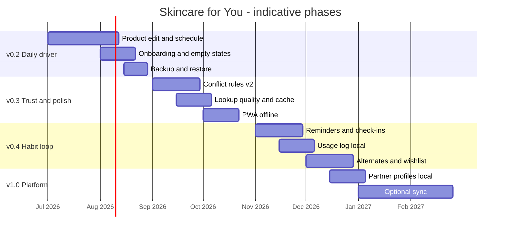

# Product roadmap

This roadmap turns [PRODUCT-VISION.md](PRODUCT-VISION.md) into delivery phases. Dates are **targets**, not commitments. Revisit each phase gate before starting the next.

**Current release:** v0.1 (foundation)  
**Next target:** v0.2 — *Daily driver*

---

## Overview

---

## Phase 0 — Foundation ✅ (shipped v0.1)

**Theme:** Prove the core loop works locally.

| Delivered | Notes |
|-----------|-------|
| Product shelf + AI/mock lookup | Server action + API route + IndexedDB |
| Auto-generated routines | Daily / weekly / monthly buckets; category ordering |
| Routine safety check | Layering, ingredient pairings, schedule match |
| Ingredient conflict warnings | ~10 rules; inline + guide summary |
| Body & cycle context | Menstrual, life stage, weight; routine holds |
| Localization | `es-419` default, `en` toggle; UI strings |
| PDF guide export | Client-side jsPDF at `/routines#guide` |
| Responsive shell | Side nav desktop, bottom nav mobile |
| Production meta basics | OG image, favicon, robots, sitemap |
| Unit tests | Vitest in `lib/` (38 tests) |

**Exit criteria:** User can add products, see Today, download guide, no server DB.

---

## Phase 1 — Daily driver (target: v0.2)

**Theme:** Remove blockers that stop someone from using the app every day.

**Goal:** A user can maintain their real shelf without delete-and-re-add workarounds.

| Initiative | Outcomes |
|------------|----------|
| **Product editing** | Change frequency, time of day, category, ingredients, usage notes |
| **Flexible scheduling** | Pick weekly day; clearer monthly cadence copy |
| **Onboarding** | First-run tour; wire `onboardingComplete`; calmer seed-shelf intro |
| **Data backup** | JSON export/import with schema version |
| **Conflict discoverability** | Shelf-wide conflicts surfaced on Products; link to Guide |

**Success gate:** 3 test users complete a week using only the app (manual dogfood); zero "I had to re-add my product" reports.

**Dependencies:** None beyond current stack.

---

## Phase 2 — Trust & polish (target: v0.3)

**Theme:** Make warnings more credible and the app feel production-grade.

| Initiative | Outcomes |
|------------|----------|
| **Conflict rules v2** | Externalized rule file; 30+ pairs; severity rationale in UI |
| **Lookup improvements** | Server-side cache; post-lookup edit; better mock labeling |
| **PWA / offline** | Installable; service worker for shell + static assets |
| **UX polish** | Dark mode toggle; PDF branding; IndexedDB error states |
| **Engineering** | CI on PR; expand test coverage for scheduling + conflicts |

**Success gate:** Lookup cache hit rate >50% in dev testing; Lighthouse PWA installable; conflict false-positive review doc.

**Dependencies:** Phase 1 edit flow (for correcting bad lookups).

---

## Phase 3 — Habit loop (target: v0.4)

**Theme:** Help users follow through, still privacy-preserving.

| Initiative | Outcomes |
|------------|----------|
| **Routine check-offs** | Mark steps done today; streak optional |
| **Reminders** | Local notifications for AM/PM (permission-based) |
| **Sensitivity modes** | Pregnancy / retinol-newbie / "rest day" toggles — *partial: life-stage holds shipped in v0.1* |
| **Routine customization** | Reorder steps; hide products from a routine without deleting |
| **Smarter Today** | "Skip actives" one-tap; weather/season notes (copy only) |
| **Alternates tab** | New main nav section — comparables for shelf products, side-by-side comparatives, curated notes; local wishlist |
| **Partner profiles (local)** | Add a partner on this device — their shelf, routines, and lifestyle context; profile switcher — *see [Partner profiles](#partner-profiles)* |

**Success gate:** Users who enable reminders return to Today 2×/day in dogfood cohort; alternates wishlist used by ≥2 dogfood users evaluating a swap; ≥1 dogfood household uses partner profile for a week.

**Dependencies:** Phase 1 scheduling; notification permission UX patterns; Phase 2 conflict rules (so alternates can flag fit with current shelf); Phase 1 backup (export includes all profiles).

### Alternates (main nav tab)

**Theme:** Help users explore swaps and upgrades without turning the app into a shopping feed.

| Capability | Description |
|------------|-------------|
| **Comparables** | For each product on your shelf, surface alternates in the same category / active family (e.g. another daily moisturizer, a gentler retinol) |
| **Comparatives** | Side-by-side view: key actives, frequency fit, conflict risk with your shelf, price tier (when data exists) |
| **Reviews & notes** | Short **curated** copy per alternate — why it might work, who it's for — not a social review marketplace |
| **Wishlist** | Save alternates locally (IndexedDB); distinct from "on my shelf"; optional "try next" tag |
| **Shelf bridge** | One-tap promote wishlist item → lookup / add to shelf when ready |

**Nav:** Fifth primary tab — **Alternates** (`/alternates`), alongside Today, Products, Routines, Lifestyle.

**Privacy:** Wishlist stays on-device by default; no account required. External shop links optional, same pattern as product cards.

**Out of scope for v0.4:** User-generated reviews, affiliate dashboards, infinite product catalog browse.

Backlog IDs: [E9 — Alternates & discovery](BACKLOG.md#e9--alternates--discovery) (`PROD-901`–`906`).

### Partner profiles

**Theme:** Skincare is often managed by one person for two — especially when a partner wouldn't set up an app on their own. Support that without stereotypes or gatekeeping.

**Insight:** Many households have one person who researches products and builds routines while their partner (man, woman, or anyone) uses what they're given — or skips care entirely. The app should let the **primary user add and manage a partner profile** on the same device, with a quick switch between "me" and "them."

| Capability | Description |
|------------|-------------|
| **Add a partner** | Optional second profile — name/label only; no gender required in UI (lifestyle context stays toggle-based) |
| **Separate shelf & routines** | Partner gets their own products, Today view, and safety checks — no accidental mixing with yours |
| **Lifestyle per profile** | Cycle, life stage, skin conditions, etc. scoped to each person |
| **Profile switcher** | Header or settings control: Me ↔ Partner (extensible to more profiles later) |
| **Caregiver mode** | You maintain their shelf; they can optionally open the app to a simplified Today (P2) |
| **Reminders** | Nudge AM/PM for partner's routine — permission on shared device (P2) |

**Local-first (v0.4):** Both profiles live in IndexedDB on one phone — no account. JSON backup/export includes all profiles.

**Platform (v1.0):** Optional sync so partner can see their Today on their own device — builds on shared routines / household work in Phase 4.

**Copy tone:** Inclusive — "partner" not "husband"; never imply only women do skincare. The feature is for *whoever manages care for someone else*.

**Out of scope for v0.4:** Social linking between accounts, parental controls, pediatric dosing.

Backlog IDs: [E10 — Partner profiles](BACKLOG.md#e10--partner-profiles) (`PROD-1001`–`1005`).

---

## Phase 4 — Platform (target: v1.0)

**Theme:** Optional cloud without betraying local-first principles.

| Initiative | Outcomes |
|------------|----------|
| **Optional account** | Sign-in for backup sync only |
| **Multi-device sync** | Encrypted shelf + settings per profile |
| **Partner sync** | Partner views their Today on their own phone (extends local partner profiles) |
| **Shared routines** | Export share link or printable handoff for a partner's routine |
| **Barcode / photo lookup** | Faster add flow (vendor TBD) |

**Success gate:** Sync conflict resolution documented; offline-first still works with account.

**Dependencies:** Auth provider choice; storage backend; legal/privacy review.

---

## How priorities are set

1. **Unblock daily use** (edit, schedule, backup)
2. **Increase trust** (rules, lookup quality, errors)
3. **Build habit** (reminders, check-offs)
4. **Enable informed swaps** (alternates, comparatives, wishlist — after shelf + rules are solid)
5. **Support households** (partner profiles local-first; sync only when retention proves value)
6. **Expand platform** (account, multi-device) only after retention proof

Full item list with IDs and acceptance criteria: [BACKLOG.md](BACKLOG.md).

## Phase gate checklist

Before promoting a phase to "done":

- [ ] Acceptance criteria met for all P0/P1 items in that phase
- [ ] [KNOWN-LIMITATIONS.md](KNOWN-LIMITATIONS.md) updated
- [ ] Unit tests for new domain logic
- [ ] Manual test on mobile viewport (375px)
- [ ] No new P0 bugs open for the phase theme
